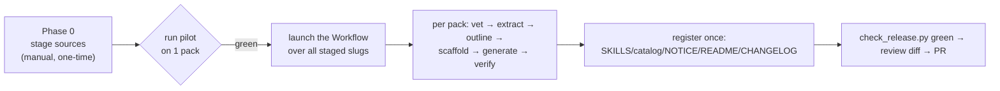

<!--
Copyright (c) 2026 JG Systems Consulting Ltd. — MIT License (see ../LICENSE).
SPDX-License-Identifier: MIT
-->

# Build Plan — implement the full pack backlog in one orchestrated run

This is the executable plan for building every candidate in [PACK-BACKLOG.md](PACK-BACKLOG.md)
(32 packs) in one go. "One go" = launching **one Workflow** that pipelines each pack through the
same gated pipeline — not a plain shell script, because the per-chapter synthesis needs the model.

> [!IMPORTANT]
> **One prerequisite gates the whole run: staged source files.** The synthesis reads the actual
> source text. Most gov sites (gao.gov, dau.edu, DTIC…) **403 automated downloads**, and the
> redistribution policy forbids committing source PDFs anyway. So you stage the sources once
> (Phase 0); then the run builds everything that's present and skips/logs what isn't.

## TL;DR



- **Stage** the source PDFs into `sources/<slug>/` (gitignored). 
- **Pilot** one pack end-to-end first to prove the pipeline.
- **Launch** the Workflow; it fans out across packs and chapters with **fail-closed licence/quality
  gates**, then updates the registries once.
- **Review** the working-tree diff and open the PR (the run does not push).

## Phase 0 — Stage sources (do this first; it is the gate)

1. Create `sources/<slug>/` per pack and drop the source file(s) in (PDF, or HTML for the two
   web-native sources). `sources/` is gitignored — the PDFs are **build inputs, never committed**.
2. Use the manifest below — it's the backlog's `doc-id` + edition so you grab the *right* version.
3. The run is **partial-safe**: it builds every slug whose `sources/<slug>/` is non-empty and
   logs the rest as `skipped: no source staged`. So you can stage a cluster, build it, repeat.

> [!TIP]
> Stage the **P0 cluster first** (8 packs) and do the first real batch on those, rather than
> waiting to download all 32.

## Phase 1 — Per-pack pipeline (what the Workflow runs for each)

Uses the `jgs-reference-skill` tools for extraction/vetting/overlap and this repo's `tooling/` for
scaffold/validate (so output matches *this* repo's gates exactly):

1. **Vet** — `jgs-reference-skill/tools/vet_source.py` (fail-closed: Excluded ⇒ skip + log).
2. **Extract** — `jgs-reference-skill/scripts/extract.py` → `sources/<slug>/.build/full_text.txt`.
3. **Outline** — `jgs-reference-skill/tools/outline.py` → `outline.json` (exact chapter offsets).
4. **Scaffold** — `tooling/build_pack.py` → `packs/<slug>/` with `PACK.yaml` + `LICENSE` + `chapters/`.
5. **Generate** (the synthesis — agents): one chapter per outline section (parallel), then
   `glossary.md` / `patterns.md` / `cheatsheet.md`, then `SKILL.md`. **Apply the per-source caveats
   from the backlog** (exclude IEEE/ISO/CMMI reprints, flag draft status, drop permission-only
   figures, use the named edition).
6. **Verify** (fail-closed): `check_overlap.py` (no verbatim run ≥ 12 words) → `validate_pack.py`
   (structure + tier) → `pack_eval.py` (every topic-index route grounded). Any fail ⇒ pack flagged
   `needs-fix`, **not** registered.
7. **Fill provenance** — complete `PACK.yaml` (pages, chapters, built_on, notes/caveats) + the
   source's `LICENSE` text.

## Phase 2 — Register (once, after the packs are built)

A single finalize step updates the repo-level registries from the set of packs that **passed**:
`SKILLS.md`, `catalog.json`, `NOTICE`, `README.md`, `CHANGELOG.md`, and the version bump. Then
`tooling/check_release.py` + `tooling/validate_pack.py --all` must be green.

## Orchestration — the "one go"

The runnable orchestrator is [`tooling/build_all_packs.workflow.js`](../tooling/build_all_packs.workflow.js).
Launch it with the Workflow tool:

```
Workflow({ scriptPath: "<abs path>/tooling/build_all_packs.workflow.js",
           args: { slugs: ["nasa-systems-modeling", "faa-sem", "gao-cost", "..."] } })
```

- `args.slugs` omitted ⇒ it builds every slug with a staged source. Pass a list to do one **batch**
  (e.g. just the P0 cluster).
- It `pipeline()`s packs (no barrier — a fast pack finishes while a slow one is still synthesising),
  fans chapters within each pack, runs the fail-closed gates, and registers passed packs at the end.
- Concurrency is capped automatically; the licence/verify gates fail-closed so a bad pack never ships.

## Recommended execution order

Build by backlog priority so value lands first and you can stop anytime:

1. **Batch A (P0, ~8):** `nasa-systems-modeling`, `faa-sem`, `gao-cost`, `nasa-ceh`, `gao-schedule`,
   `nasa-schedule`, `dod-te-guidebook`, `faa-ams-vv`.
2. **Batch B (P1, ~14):** reliability, CM, software/agile, MOSA/CPS, risk, readiness, DE, core-depth.
3. **Batch C (P2, ~10):** niche/large/supporting.

## Risk controls (why this is safe to run unattended-ish)

- **Pilot first.** Run the Workflow on **one** slug (`nasa-systems-modeling`) and inspect the pack
  before launching a batch. Don't auto-build 32 before proving the pipeline on 1.
- **Fail-closed gates.** Vet (Excluded), overlap (verbatim), validate (structure/tier) all block a
  pack from registering — quality is enforced mechanically, not on trust.
- **Human spot-check before merge.** Packs land in the **working tree**; the run does **not** push.
  Review the diff (and the per-pack overlap/validate logs) before the PR.
- **Token cost is large** (~32 × 6–8 chapters of synthesis). Batch by cluster if you want to cap a
  single run.

## Source staging manifest

Drop each into `sources/<slug>/`. `Fmt` = expected format. (No download URLs here — link policy;
grab the named `doc-id`/edition from the publisher.)

| Slug | doc-id / edition | Publisher | Fmt | Pri |
|---|---|---|---|---|
| `nasa-systems-modeling` | NASA-HDBK-1009A (Rev A, 2025) | NASA | PDF | P0 |
| `faa-sem` | FAA Systems Engineering Manual v1.0.1 | FAA | PDF | P0 |
| `gao-cost` | GAO-20-195G | GAO | PDF | P0 |
| `nasa-ceh` | NASA Cost Estimating Handbook v4.0 | NASA | PDF | P0 |
| `gao-schedule` | GAO-16-89G | GAO | PDF | P0 |
| `nasa-schedule` | NASA Schedule Management Handbook (2024) | NASA | PDF | P0 |
| `dod-te-guidebook` | DoD T&E Enterprise Guidebook (Aug 2022) | OUSD R&E | PDF | P0 |
| `faa-ams-vv` | FAA AMS Lifecycle V&V Guidelines v3.0 | FAA | PDF | P0 |
| `nasa-de-acquisition` | NASA-HDBK-1004 | NASA | PDF | P1 |
| `dod-digital-engineering` | DoD Digital Engineering Strategy 2018 | OUSD R&E | PDF | P1 |
| `nasa-se-expanded` | NASA/SP-2016-6105-SUPPL Vols 1–2 | NASA | PDF | P1 |
| `nasa-rm-standard` | NASA-STD-8729.1A | NASA | PDF | P1 |
| `faa-rma` | FAA-HDBK-006D (2020) | FAA | PDF | P1 |
| `nasa-pra` | NASA/SP-2011-3421 | NASA | PDF | P1 |
| `dod-rio` | DoD RIO Mgmt Guide (Sep 2023 +Ch2.2) | OUSD R&E | PDF | P1 |
| `nasa-swehb` | NASA-HDBK-2203 (Ver D, 2020) | NASA | PDF | P1 |
| `gao-agile` | GAO-24-105506 | GAO | PDF | P1 |
| `dod-mosa` | MOSA Implementation Guidebook (Feb 2025) | OUSD R&E | PDF | P1 |
| `nist-cps` | NIST SP 1500-201/202/203 | NIST | PDF×3 | P1 |
| `mil-hdbk-61` | MIL-HDBK-61B (Change 1, 2025) | DoD | PDF | P1 |
| `mrl-deskbook` | MRL Deskbook (v2025) | OSD ManTech | PDF | P1 |
| `nasa-fault-management` | NASA-HDBK-1002 (Draft 2) | NASA | PDF | P2 |
| `dod-mq-bok` | DoD M&Q Body of Knowledge (Jul 2025) | OUSD R&E | PDF | P2 |
| `faa-hf-std` | FAA HF-STD-001B (2016) | FAA | PDF | P2 |
| `faa-req-handbook` | DOT/FAA/AR-08/32 (2009) | DOT/FAA | PDF | P2 |
| `nist-stat-handbook` | NIST/SEMATECH e-Handbook (HB 151) | NIST | HTML | P2 |
| `sd-22-dmsms` | SD-22 DMSMS Guidebook (Apr 2024) | DSPO | PDF | P2 |
| `grcse` | GRCSE v1.1 (2015) | BKCASE/Stevens | PDF | P2 |
| `dau-glossary` | DAU Glossary (dated DTIC edition) | DAU | PDF | P2 |
| `digital-systems-engineering` | arXiv:2002.11672 (CC BY 4.0 PDF) | arXiv | PDF | P2 |
| `nist-800-37` | NIST SP 800-37 Rev 2 | NIST | PDF | P1 |
| `faa-system-safety` | FAA System Safety Handbook | FAA | PDF | P1 |

## What I need from you to actually run it

1. Stage at least the **P0 cluster** into `sources/<slug>/` (or tell me to attempt fetches — many
   will 403, but NIST/NTRS/arXiv usually work).
2. Say "pilot `nasa-systems-modeling`" → I run one pack and you inspect it.
3. Say "run batch A" → I launch the Workflow over the staged P0 slugs.
